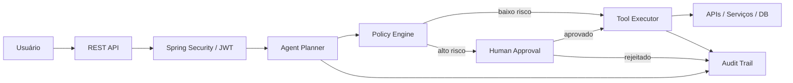

# 🛡️ SecureAgent Hub

> **Secure AI Agent Execution Platform** — Java, Spring Boot, policy enforcement, Human-in-the-Loop and auditability.

[](https://openjdk.org/projects/jdk/21/)
[](https://spring.io/projects/spring-boot)
[](https://www.postgresql.org/)
[](https://www.docker.com/)
[](https://github.com/juceliocoelho2022/secure-agent-hub/actions/workflows/ci.yml)

O **SecureAgent Hub** é um projeto de engenharia para estudar como colocar agentes de IA em produção sem entregar controle irrestrito ao modelo. A plataforma separa a interpretação da intenção da execução real, aplicando **autenticação, RBAC, políticas, aprovação humana e auditoria**.

> **Princípio arquitetural:** o LLM pode interpretar a intenção. O backend controla a execução.

---

## 🎯 Visão do produto

<p align="center">
  
</p>

> A imagem acima representa a **visão de produto / mockup do dashboard**. A versão atual do repositório é focada no backend e APIs; a interface será implementada em uma etapa futura.

---

## ✨ O que já existe — v1.1

| Capacidade | Status |
|---|---|
| Java 21 + Spring Boot | ✅ |
| PostgreSQL + Flyway | ✅ |
| JWT Bearer Authentication | ✅ |
| Refresh token persistido e rotacionado | ✅ |
| RBAC (`ANALYST`, `OPERATOR`, `AUDITOR`, `ADMIN`) | ✅ |
| Policy Engine | ✅ |
| Human-in-the-Loop | ✅ |
| Audit Trail | ✅ |
| Docker Compose | ✅ |
| JUnit / Mockito / JaCoCo | ✅ base |
| GitHub Actions CI | ✅ |
| Kafka + Outbox + Idempotência | 🚧 v1.2 |
| Spring AI + Tool Calling | 🗺️ v1.3 |
| RAG + pgvector | 🗺️ v1.4 |
| OpenTelemetry + Prometheus + Grafana | 🗺️ v1.5 |
| AWS + Terraform + Kubernetes | 🗺️ v2.0 |

---

## 🏗️ Arquitetura atual



Na v1.1, o agente utiliza `RuleBasedAgentPlanner`. Isso é intencional: primeiro consolidamos **identidade, autorização e controle de execução**. A integração real com LLM/Spring AI entra na v1.3.

📚 Veja a documentação detalhada em [`docs/ARCHITECTURE.md`](docs/ARCHITECTURE.md).

---

## 🔐 Segurança por design

O projeto foi estruturado para praticar controles que se tornam críticos quando agentes passam a executar ferramentas reais:

- JWT Bearer + refresh token rotacionado;
- RBAC e privilégio mínimo;
- Policy Engine antes de operações sensíveis;
- Human-in-the-Loop para ações críticas;
- trilha de auditoria;
- segredo JWT configurável por ambiente;
- roadmap para idempotência, DLT, observabilidade e proteção contra abuso de tools.

Consulte [`SECURITY.md`](SECURITY.md).

---

## 🧰 Stack

**Backend**

`Java 21` · `Spring Boot 3.5.5` · `Spring Security` · `Spring Data JPA` · `OAuth2 Resource Server / JWT`

**Dados**

`PostgreSQL 17` · `Flyway`

**Qualidade & Operação**

`JUnit 5` · `Mockito` · `JaCoCo` · `Docker Compose` · `GitHub Actions`

**Próximas camadas**

`Kafka` · `Spring AI` · `pgvector` · `OpenTelemetry` · `Prometheus` · `Grafana` · `AWS` · `Terraform` · `Kubernetes`

---

## 🚀 Executando localmente

### Pré-requisitos

- Java 21
- Maven 3.9+
- Docker / Docker Compose

### 1. Suba o PostgreSQL

```bash
docker compose up -d
```

### 2. Configure um segredo JWT

Linux/macOS:

```bash
export JWT_SECRET='um-segredo-longo-forte-e-gerenciado-fora-do-codigo'
```

PowerShell:

```powershell
$env:JWT_SECRET="um-segredo-longo-forte-e-gerenciado-fora-do-codigo"
```

### 3. Execute

```bash
mvn spring-boot:run
```

### 4. Valide o build

```bash
mvn clean verify
```

---

## 👥 Usuários de laboratório

| Usuário | Senha | Papel |
|---|---|---|
| `analyst` | `analyst123` | ANALYST |
| `operator` | `operator123` | OPERATOR |
| `auditor` | `auditor123` | AUDITOR |
| `admin` | `admin123` | ADMIN |

⚠️ Credenciais exclusivamente para laboratório local. Em produção, o roadmap prevê integração com IdP/OIDC e `BOOTSTRAP_DEV_USERS=false`.

---

## 🔑 Fluxo de autenticação

### Login

```http
POST /api/v1/auth/login
Content-Type: application/json
```

```json
{
  "username": "analyst",
  "password": "analyst123"
}
```

### Perfil autenticado

```http
GET /api/v1/users/me
Authorization: Bearer <accessToken>
```

### Refresh

```http
POST /api/v1/auth/refresh
```

O refresh token utilizado é revogado e um novo par é emitido.

Exemplos completos estão em [`http-requests.http`](http-requests.http).

---

## 🧑‍⚖️ RBAC

| Área | Acesso |
|---|---|
| Execuções de agente | usuário autenticado |
| Aprovações | `OPERATOR` ou `ADMIN` |
| Auditoria | `AUDITOR` ou `ADMIN` |
| Perfil | usuário autenticado |

---

## 🛣️ Roadmap

```text
v1.1  Security Foundation          ✅
  ↓
v1.2  Event-Driven / Kafka         🚧
  ↓
v1.3  Spring AI / Tool Calling     🗺️
  ↓
v1.4  RAG / pgvector               🗺️
  ↓
v1.5  Observability / AgentOps     🗺️
  ↓
v2.0  AWS / Terraform / EKS        🗺️
```

Detalhes: [`ROADMAP.md`](ROADMAP.md).

---

## 🔥 Próximo marco — v1.2 Event Driven

A próxima versão transforma o projeto em uma arquitetura orientada a eventos:

```text
Domain Transaction
       ↓
Transactional Outbox
       ↓
Outbox Publisher
       ↓
Kafka
       ↓
Consumer
       ↓
Idempotency Check
   ↙          ↘
processa      ignora duplicata
   ↓
Retry / Backoff
   ↓
DLT em falha permanente
```

Objetivos técnicos: **Kafka, Transactional Outbox, idempotência, retry/backoff, DLT e correlação de eventos**.

---

## 📖 Documentação

- [Arquitetura](docs/ARCHITECTURE.md)
- [Roadmap](ROADMAP.md)
- [Política de Segurança](SECURITY.md)
- [Como contribuir](CONTRIBUTING.md)
- [Exemplos HTTP](http-requests.http)

---

## 👨‍💻 Autor

**Jucelio Farias Coelho**  
Java Backend · Spring Boot · Sistemas Distribuídos · Cloud · IA aplicada

Este projeto faz parte de uma jornada prática para conectar **engenharia de software tradicional + segurança + cloud + agentes de IA**.
