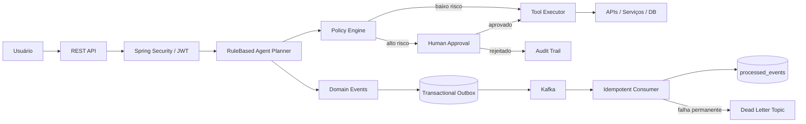

# 🛡️ SecureAgent Hub

> **Secure AI Agent Execution Platform** — Java, Spring Boot, security, policy enforcement, Human-in-the-Loop and event-driven architecture.

[](https://openjdk.org/projects/jdk/21/)
[](https://spring.io/projects/spring-boot)
[](https://www.postgresql.org/)
[](https://kafka.apache.org/)
[](https://www.docker.com/)
[](https://github.com/juceliocoelho2022/secure-agent-hub/actions/workflows/ci.yml)

O **SecureAgent Hub** é um projeto de engenharia para estudar como colocar agentes de IA em produção sem entregar controle irrestrito ao modelo. A plataforma separa a interpretação da intenção da execução real, aplicando **autenticação, RBAC, políticas, aprovação humana, auditoria e processamento assíncrono resiliente**.

> **Princípio arquitetural:** o LLM pode interpretar a intenção. O backend controla a execução.

---

## 🎯 Visão do produto

<p align="center">
  
</p>

> A imagem representa a **visão de produto / mockup do dashboard**. A versão atual é focada no backend e APIs; Spring AI, RAG, observabilidade completa e interface serão adicionados incrementalmente.

---

## ✨ Estado atual — v1.2 Event Driven

| Capacidade | Status |
|---|---|
| Java 21 + Spring Boot 3.5.5 | ✅ |
| PostgreSQL 17 + Flyway | ✅ |
| JWT Bearer Authentication | ✅ |
| Refresh token persistido e rotacionado | ✅ |
| RBAC (`ANALYST`, `OPERATOR`, `AUDITOR`, `ADMIN`) | ✅ |
| Policy Engine | ✅ |
| Human-in-the-Loop | ✅ |
| Audit Trail | ✅ |
| Apache Kafka 3.9.1 | ✅ |
| Transactional Outbox | ✅ |
| `DomainEventEnvelope` versionado | ✅ |
| Kafka producer idempotente | ✅ |
| Consumer idempotente / deduplicação | ✅ |
| Retry + exponential backoff | ✅ |
| Dead Letter Topic | ✅ |
| JUnit / Mockito / JaCoCo | ✅ |
| GitHub Actions CI | ✅ |
| Spring AI + Tool Calling | 🗺️ v1.3 |
| RAG + pgvector | 🗺️ v1.4 |
| OpenTelemetry + Prometheus + Grafana | 🗺️ v1.5 |
| AWS + Terraform + Kubernetes | 🗺️ v2.0 |

---

## 🏗️ Arquitetura atual



Na v1.2, o agente ainda utiliza `RuleBasedAgentPlanner`. Isso é intencional: consolidamos primeiro **identidade, autorização, controle de execução e infraestrutura distribuída**. A integração real com LLM/Spring AI entra na v1.3.

📚 Documentação: [`docs/ARCHITECTURE.md`](docs/ARCHITECTURE.md) · [`docs/EVENTS.md`](docs/EVENTS.md)

---

## ⚡ Event-Driven v1.2

```text
Business transaction
       ↓
DomainEventService
       ↓
Transactional Outbox (PostgreSQL)
       ↓
OutboxPublisher
       ↓
secure-agent.events (Kafka)
       ↓
DomainEventConsumer
   ↙                 ↘
sucesso             falha
  ↓                   ↓
processed_events    retry / backoff
                      ↓
              secure-agent.events.DLT
```

Os eventos utilizam um envelope padronizado com `eventId`, `eventType`, `aggregateType`, `aggregateId`, `occurredAt`, `correlationId`, `causationId`, `schemaVersion` e `payload`.

A arquitetura assume **at-least-once delivery**. Duplicações são tratadas explicitamente pelo consumer através de `processed_events`; não há alegação de exactly-once end-to-end.

---

## 🔐 Segurança por design

- JWT Bearer + refresh token rotacionado;
- RBAC e privilégio mínimo;
- Policy Engine antes de operações sensíveis;
- Human-in-the-Loop para ações críticas;
- trilha de auditoria;
- segredo JWT configurável por ambiente;
- eventos assíncronos não contornam políticas de execução;
- falhas permanentes do consumer são isoladas em DLT;
- roadmap para observabilidade, RAG e proteção contra abuso de tools.

Consulte [`SECURITY.md`](SECURITY.md).

---

## 🧰 Stack

**Backend**  
`Java 21` · `Spring Boot 3.5.5` · `Spring Security` · `Spring Data JPA` · `OAuth2 Resource Server / JWT`

**Dados & Eventos**  
`PostgreSQL 17` · `Flyway` · `Apache Kafka 3.9.1` · `Transactional Outbox`

**Qualidade & Operação**  
`JUnit 5` · `Mockito` · `JaCoCo` · `Docker Compose` · `GitHub Actions`

**Próximas camadas**  
`Spring AI` · `pgvector` · `OpenTelemetry` · `Prometheus` · `Grafana` · `AWS` · `Terraform` · `Kubernetes`

---

## 🚀 Executando localmente

### Pré-requisitos

- Java 21
- Maven 3.9+
- Docker / Docker Compose

### 1. Suba PostgreSQL e Kafka

```bash
docker compose up -d
```

Portas locais do Compose:
- aplicação: `8080`;
- PostgreSQL do projeto: `5433`;
- Kafka: `9092`.

### 2. Configure um segredo JWT

Linux/macOS:

```bash
export JWT_SECRET='um-segredo-longo-forte-e-gerenciado-fora-do-codigo'
```

PowerShell:

```powershell
$env:JWT_SECRET="um-segredo-longo-forte-e-gerenciado-fora-do-codigo"
```

### 3. Execute

```bash
mvn spring-boot:run
```

### 4. Valide o build

```bash
mvn clean verify
```

O CI executa `mvn clean verify` e publica o relatório JaCoCo como artifact.

---

## 👥 Usuários de laboratório

| Usuário | Senha | Papel |
|---|---|---|
| `analyst` | `analyst123` | ANALYST |
| `operator` | `operator123` | OPERATOR |
| `auditor` | `auditor123` | AUDITOR |
| `admin` | `admin123` | ADMIN |

⚠️ Credenciais exclusivamente para laboratório local. Para produção, utilize IdP/OIDC e mantenha `BOOTSTRAP_DEV_USERS=false`.

---

## 🔑 Autenticação

```http
POST /api/v1/auth/login
Content-Type: application/json
```

```json
{
  "username": "analyst",
  "password": "analyst123"
}
```

Perfil autenticado:

```http
GET /api/v1/users/me
Authorization: Bearer <accessToken>
```

Refresh:

```http
POST /api/v1/auth/refresh
```

O refresh token utilizado é revogado e um novo par é emitido. Exemplos completos estão em [`http-requests.http`](http-requests.http).

---

## 🧑‍⚖️ RBAC

| Área | Acesso |
|---|---|
| Execuções de agente | usuário autenticado |
| Aprovações | `OPERATOR` ou `ADMIN` |
| Auditoria | `AUDITOR` ou `ADMIN` |
| Perfil | usuário autenticado |

---

## 🛣️ Roadmap

```text
v1.0  Secure Foundation            ✅
  ↓
v1.1  JWT / Persisted RBAC         ✅
  ↓
v1.2  Event-Driven / Kafka         ✅
  ↓
v1.3  Spring AI / Tool Calling     ▶
  ↓
v1.4  RAG / pgvector               🗺️
  ↓
v1.5  Observability / AgentOps     🗺️
  ↓
v2.0  AWS / Terraform / EKS        🗺️
```

Detalhes: [`ROADMAP.md`](ROADMAP.md).

---

## 🤖 Próximo marco — v1.3 Spring AI

A próxima versão introduzirá interpretação probabilística e Tool Calling sem entregar ao LLM autoridade direta sobre execução:

```text
User Intent
    ↓
Spring AI / ChatClient
    ↓
Structured Tool Proposal
    ↓
Policy Engine
   ↙       ↘
ALLOW     REQUIRE_APPROVAL
  ↓             ↓
Tool       Human-in-the-Loop
Execution        ↓
           controlled execution
```

Objetivos: **ChatClient, Tool Calling, structured output, provider abstraction, integração obrigatória com Policy Engine e métricas de tokens/custo**.

---

## 📖 Documentação

- [Arquitetura](docs/ARCHITECTURE.md)
- [Eventos e delivery semantics](docs/EVENTS.md)
- [Roadmap](ROADMAP.md)
- [Política de Segurança](SECURITY.md)
- [Como contribuir](CONTRIBUTING.md)
- [Exemplos HTTP](http-requests.http)

---

## 👨‍💻 Autor

**Jucelio Farias Coelho**  
Java Backend · Spring Boot · Sistemas Distribuídos · Cloud · IA aplicada

Este projeto faz parte de uma jornada prática para conectar **engenharia de software tradicional + segurança + sistemas distribuídos + cloud + agentes de IA**.
