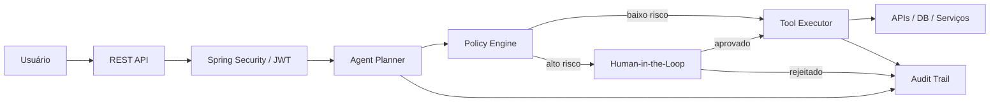
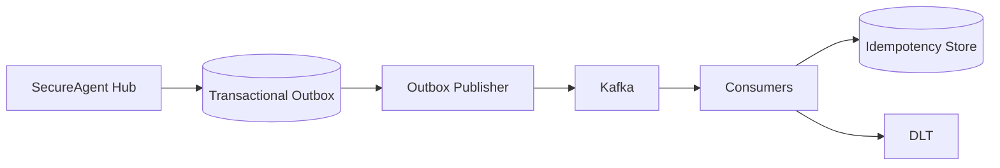
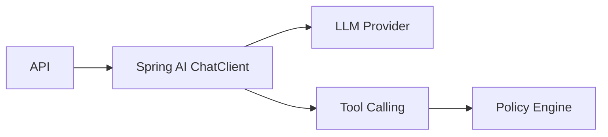
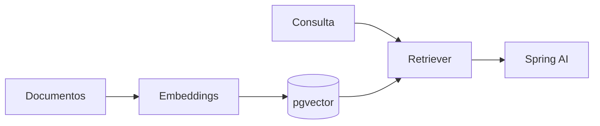

# SecureAgent Hub — Architecture

## Objetivo

O SecureAgent Hub é uma plataforma de execução segura de agentes de IA. O princípio central é separar **interpretação probabilística** de **execução determinística**.

> O LLM pode interpretar a intenção. O backend controla a execução.

## Visão de alto nível

## Componentes

### Identity & Access
- autenticação via JWT Bearer
- refresh token rotacionado
- RBAC com `ANALYST`, `OPERATOR`, `AUDITOR`, `ADMIN`
- segregação entre leitura, execução, aprovação e auditoria

### Agent Planner
Na v1.1, o planejamento é determinístico (`RuleBasedAgentPlanner`). Isso reduz risco enquanto a camada de controle é validada. Spring AI entra na v1.3.

### Policy Engine
Intercepta ações propostas pelo agente e decide entre:
- permitir automaticamente;
- exigir aprovação humana;
- rejeitar a operação.

### Human-in-the-Loop
Operações críticas ficam pendentes até decisão explícita de um operador autorizado.

### Audit Trail
Eventos relevantes ficam registrados para rastreabilidade, investigação e compliance.

## Evolução arquitetural

### v1.2 — Event Driven

Objetivos:
- transactional outbox;
- Kafka;
- retries com backoff;
- DLT;
- consumers idempotentes;
- correlação de eventos.

### v1.3 — Spring AI

### v1.4 — RAG

### v1.5 — Observability
- OpenTelemetry
- Prometheus
- Grafana
- traces distribuídos
- métricas de latência, falhas, aprovações e tool calls

## Decisões de engenharia

1. **Security first** — nenhum agente executa ações sem passar pela camada de políticas.
2. **Human control** — ações críticas suportam aprovação explícita.
3. **Auditability** — decisões e execuções relevantes deixam trilha.
4. **Incremental complexity** — IA real entra após identidade, autorização e políticas estarem sólidas.
5. **Production-minded** — roadmap inclui mensageria, observabilidade, CI/CD e cloud.
