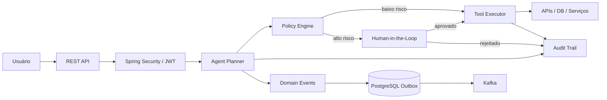
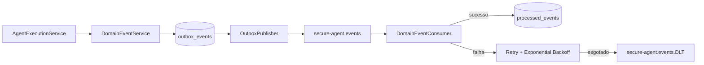
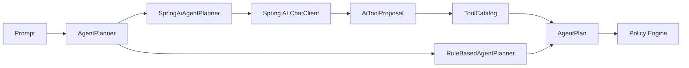
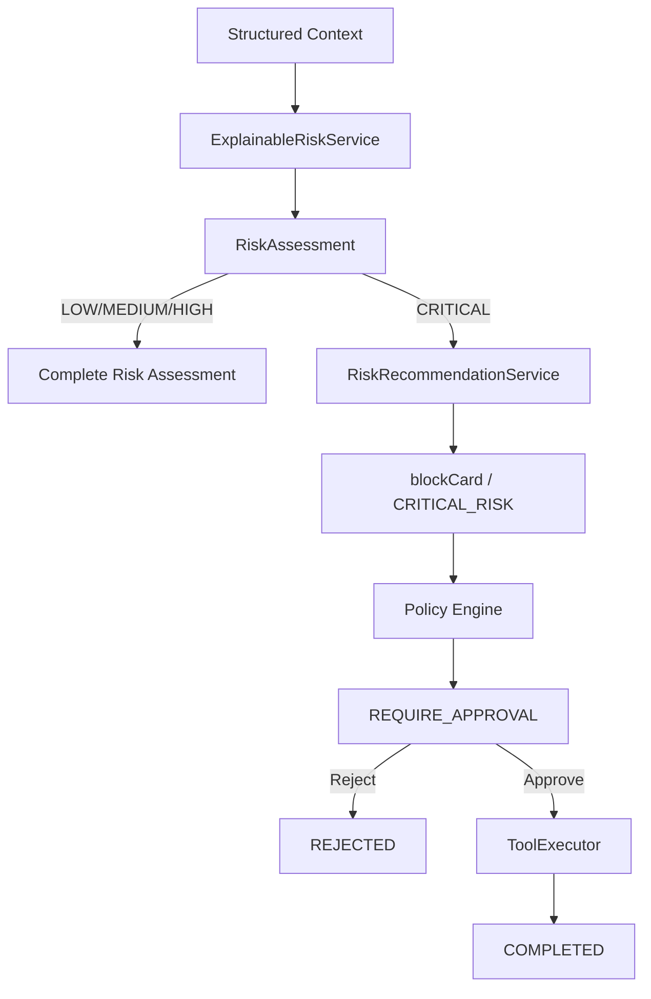
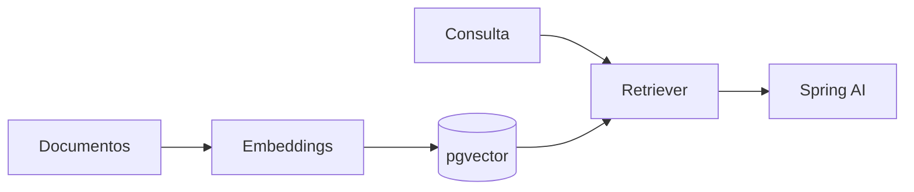

# SecureAgent Hub — Architecture

## Objetivo

O SecureAgent Hub é uma plataforma de execução segura de agentes de IA. O princípio central é separar **interpretação probabilística** de **execução determinística**.

> **O LLM interpreta. O Risk Engine calcula. O Policy Engine autoriza. O humano aprova ações críticas. O backend executa.**
## Visão de alto nível



## Componentes

### Identity & Access
- autenticação via JWT Bearer;
- refresh token rotacionado;
- RBAC com `ANALYST`, `OPERATOR`, `AUDITOR`, `ADMIN`;
- segregação entre leitura, execução, aprovação e auditoria.

### Agent Planner
Na v1.2, o planejamento continua determinístico (`RuleBasedAgentPlanner`). Isso é intencional: identidade, autorização, políticas, Human-in-the-Loop e infraestrutura de eventos são consolidados antes da introdução do LLM. Spring AI entra na v1.3.

### Policy Engine
Intercepta ações propostas pelo agente e decide entre:
- permitir automaticamente;
- exigir aprovação humana;
- rejeitar a operação.

O modelo de IA não recebe autoridade para ignorar essa decisão.

### Human-in-the-Loop
Operações críticas ficam pendentes até decisão explícita de um operador autorizado.

### Audit Trail
Decisões e execuções relevantes ficam registradas para rastreabilidade, investigação e compliance.

## v1.2 — Event-Driven Architecture

A v1.2 está implementada e validada. Eventos de domínio são persistidos por Transactional Outbox e posteriormente publicados no Kafka.



### DomainEventEnvelope

Cada novo evento possui envelope padronizado com:
- `eventId`;
- `eventType`;
- `aggregateType`;
- `aggregateId`;
- `occurredAt`;
- `correlationId`;
- `causationId`;
- `schemaVersion`;
- `payload`.

O UUID do registro no outbox é o mesmo `eventId` enviado ao Kafka.

### Transactional Outbox

O evento é gravado em `outbox_events` junto ao fluxo transacional da aplicação. O `OutboxPublisher` publica registros pendentes no tópico `secure-agent.events` e marca `published_at` após confirmação do Kafka.

Isso reduz o risco do dual-write entre banco e broker. A arquitetura continua assumindo **at-least-once delivery**.

### Producer

O producer Kafka utiliza `acks=all` e idempotência habilitada. Idempotência do producer reduz duplicações causadas por retries de publicação, mas não substitui a idempotência do consumer.

### Idempotent Consumer

`DomainEventConsumer` verifica `processed_events` por `eventId`. Eventos já processados são ignorados. Um evento concluído com sucesso é persistido no ledger de processamento.

Eventos que falham não são marcados como processados.

### Retry / DLT

Falhas do consumer passam pelo `DefaultErrorHandler` com exponential backoff. Após o esgotamento da política de retry, `DeadLetterPublishingRecoverer` encaminha o registro original para `secure-agent.events.DLT`.

A DLT protege o lado do consumer. Falhas permanentes do publisher do outbox ainda são um ponto separado de hardening.

### Contratos

O catálogo de eventos, envelope, semântica de entrega, idempotência, retry e DLT estão detalhados em [`EVENTS.md`](EVENTS.md).

## v1.3 — Controlled Spring AI + Explainable Risk

A v1.3 está implementada e mantém a fronteira de segurança construída nas versões anteriores: interpretação probabilística não recebe autoridade de execução.

### Controlled Planner



O `ChatClient` produz uma proposta estruturada. O backend valida a tool contra `ToolCatalog`. O modelo não recebe `ToolExecutor`, callbacks de execução ou autoridade de aprovação.

### Planner provenance e telemetria

Cada `AgentPlan` registra a origem:
- `RULE_BASED`;
- `SPRING_AI`.

Quando o provider disponibiliza usage metadata, a execução persiste:
- `promptTokens`;
- `completionTokens`;
- `totalTokens`.

Não são fabricados valores `0` quando a telemetria do provider está indisponível.

### Fail-safe

Falha de provider, resposta nula, payload malformado ou tool fora da allowlist aciona fallback determinístico para `RuleBasedAgentPlanner`.

### Explainable Risk Engine

O fluxo de risco recebe contexto estruturado e calcula score no backend.

Regras iniciais:
- `HIGH_AMOUNT` +35;
- `FOREIGN_COUNTRY` +25;
- `UNUSUAL_HOUR` +20;
- `RAPID_RETRY` +15;
- `KNOWN_DEVICE` -10.

Faixas:
- `0–29` LOW;
- `30–59` MEDIUM;
- `60–79` HIGH;
- `80–100` CRITICAL.

O score é limitado ao intervalo `0..100`.

### Risk → Recommendation → Policy → HITL



**Recomendação não é autorização.** `RiskRecommendationService` pode recomendar `blockCard` para risco `CRITICAL`, mas a ação protegida obrigatoriamente volta ao `PolicyService`.

A execução original é reutilizada para manter score, reasons, recommendation, aprovação e execução controlada no mesmo agregado.

### Cenário TX-9001

```text
Amount: 9800
Country: US
Usual country: BR
Hour: 2
Rapid retry: true
Known device: false

=> 95 / CRITICAL
=> HIGH_AMOUNT
=> FOREIGN_COUNTRY
=> UNUSUAL_HOUR
=> RAPID_RETRY
=> Recommended Action: blockCard
=> Reason: CRITICAL_RISK
=> Policy: REQUIRE_APPROVAL
```

### Dashboard / Operational Intelligence

O command center expõe dados reais da aplicação:
- Execution Status;
- Planner Usage;
- Approval Pressure;
- Risk Overview;
- Recommended Action;
- Event Pipeline Health;
- Execution Inspector;
- timeline governada;
- tema dark/light.

Métricas indisponíveis são apresentadas como `n/a`; a interface não inventa saúde de Kafka/DLT sem telemetria confiável.

### Security invariant

```text
LLM output
   ↓
Backend validation
   ↓
Risk Engine (quando aplicável)
   ↓
Policy Engine
   ↓
Human approval (quando obrigatório)
   ↓
Controlled backend execution
```

Nem saída de LLM nem score de risco executam uma ação protegida diretamente.
## v1.4 — RAG



## v1.5 — Observability / AgentOps
- OpenTelemetry;
- Prometheus;
- Grafana;
- traces distribuídos;
- métricas de latência, falhas, aprovações, tool calls e tokens;
- SLOs e alertas.

## Decisões de engenharia

1. **Security first** — nenhum agente executa ações sem passar pela camada de políticas.
2. **Human control** — ações críticas suportam aprovação explícita.
3. **Auditability** — decisões e execuções relevantes deixam trilha.
4. **At-least-once + idempotency** — duplicação é tratada como possibilidade arquitetural, não ignorada.
5. **Transactional Outbox** — evita dependência de uma transação distribuída entre PostgreSQL e Kafka.
6. **Failure isolation** — falhas permanentes do consumer são encaminhadas à DLT.
7. **Incremental complexity** — IA real entra após identidade, autorização, políticas e mensageria estarem sólidas.
8. **Production-minded** — roadmap inclui observabilidade, CI/CD, cloud e hardening para múltiplas réplicas.
